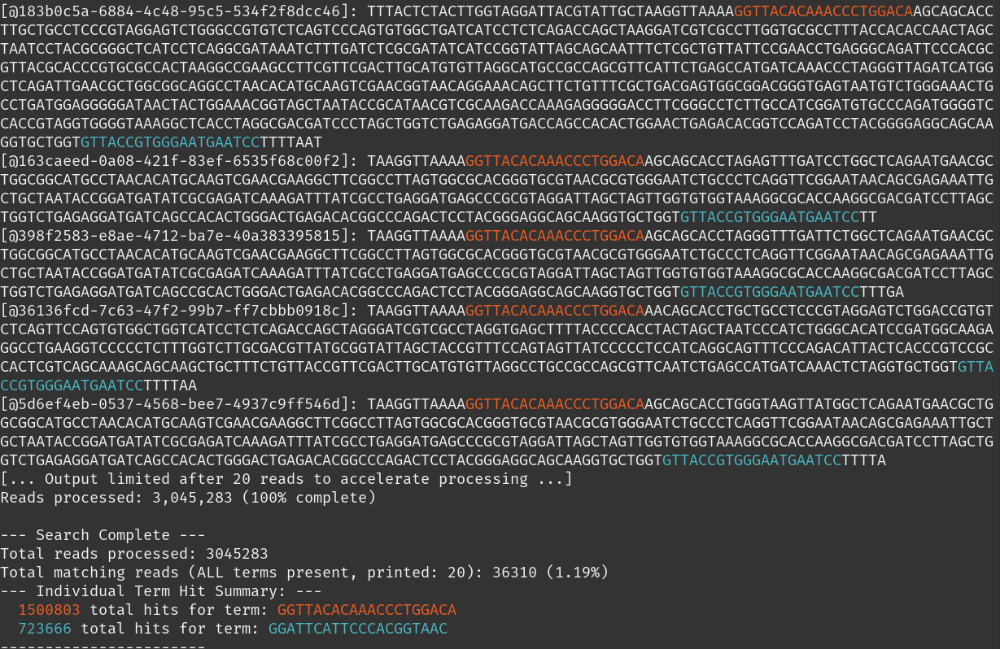
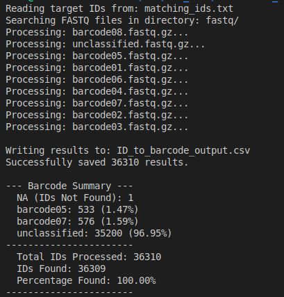

grep for reads
===

If you need to use grep with multiple colors and search terms to visually inspect reads for problems.

## What does it do
* quick grep tool to highlight sequence patterns in fastq files
* e.g., searching and vis for multi barcodes, primers, or remaining adapters
* supports reverse complement search `--rc`
* colors are red, blue, green, yellow, and up to 9 search terms per color
    * `-r1` would be a search term colored in red
    * see also --help
* can multithread if .fastq was used as an input; .fastq.gz is slow
* creates an output file `matching_ids.txt` with all IDs where all searched sequence patterns were found. 

Example code:
```
python3 searcher.py all.fastq -r1 "GGTTACACAAACCCTGGACA" -b2 "GGATTCATTCCCACGGTAAC" -rc --limit 20
```

## terminal output



Search for IDs
===
## What does it do
Searches through FASTQ files (including gzipped formats) to find specific read IDs provided in a list. When a match is found, it extracts the associated barcode sequence from the header line and compiles the results into a CSV file.

Files Required
* Read ID File (.txt): A text file containing one target read ID per line (e.g., matching_ids.txt (from previous script)).
* Reads Folder: A directory containing your read files (.fastq or fastq.gz), which you want so screen.

Example code:
```
python3 ID_finder.py my_reads.txt /data/sequencing/run1
```

## Output

The script generates a CSV file (default: ID_to_barcode_output.csv) with the following two columns: ID, barcode

## Terminal output

